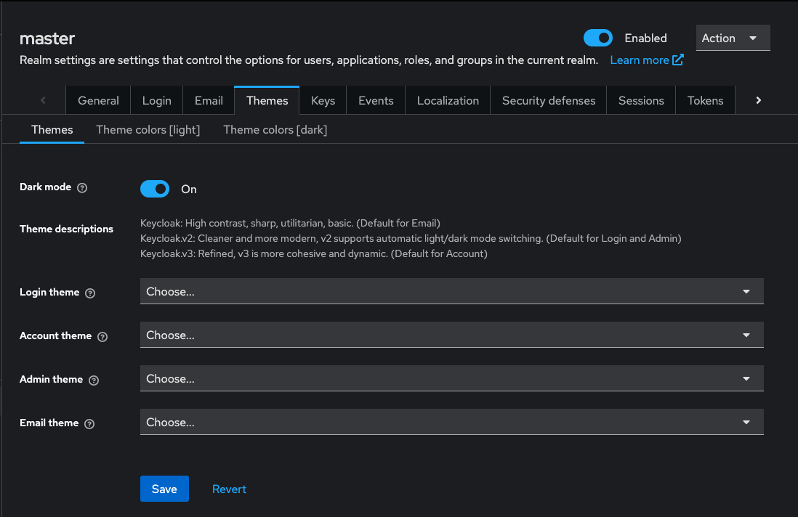

## Codes of Conduct:

This week in class we explored different codes of conduct. A CoC isn't just another markdown file you can add to a repository. It allows you to define and shape how a project's community interacts. <!--more-->And this is crucial to an open source project's success, as I will touch on again below. Click [here](https://ossd-s26.github.io/deweesevs-weekly/CoC-Activity/) to view the blog post for Week 2's Code of Conduct Activity.

## Concensus and Transparency Within Open Source Communities:
    
Open source communities are asynchronous and spread out. So communication and transparency are at the core of their success. If communication stops, input necessary to develop the project ceases, and things can go sideways.

As a result, communities often adopt codes of conduct. They can be great for helping contributors handle disagreements, give input that shapes decisions, and ensure everyone is included. They also provide a mechanism to push back on bad actors.

The power of open source is that different minds are able to contribute to the same goal. This helps shape the project into the best form it can be. Communities must be open to discussion and hearing others' ideas. Even if someone's idea is the best idea, taking time to get input and feedback can be benificial.

Because a project's contributors can span multiple time zones, it is important to be flexible with holding meetings. Try and hold them at different times, that way no one in particular must take on the burden of the time difference. Also ensure the agenda is flexible. A fixed meeting agenda can limit creativity.

Unfortunately, transparency often comes second. Communication channels may be private and the reasoning behind decisions is forgotten with time. One of the best things you can do for a project is to document decisions and rationales publicly, such as on a wiki. This allows current and future contributors to all understand why a decision was made.

## Pull Request on Keycloak:

I am working on a project that will use Keycloak. It is an Open Source Identity Access Management (IAM) tool that supports Single Sign-On, Social Sign-On, 2FA, and a suite of other functions. 

Someone asked me if we could apply our own styling to the themes, and which theme did what. We could. But it got me thinking: 'Why is it so ambiguous?' The names are not descriptive, nor are defaults stated.

So I forked Keycloak's repository and started snooping around. Looking through the changelogs and trying the different themes, I determined the defaults for each page (they are not all the same). 

Because Keycloak is built to work with different languages, text is not hardcoded into the TSX components. There are big files titled `messages_**.properties` that correspond to each lanuage (** = `en`, `nl`, `fr`, etc.) and are imported based on the set lanuage. So I wrote the theme descriptions and placed them in `messages_en.properties`.

```properties
themesDescriptionsTitle=Theme descriptions
themesDescriptionKeycloak=Keycloak: High contrast, sharp, utilitarian, basic. (Default for Email)
themesDescriptionKeycloakV2=Keycloak.v2: Cleaner and more modern, v2 supports automatic light/dark mode switching. (Default for Login and Admin)
themesDescriptionKeycloakV3=Keycloak.v3: Refined, v3 is more cohesive and dynamic. (Default for Account)
```

To display them on the theme selection page, I navigated to `ThemeSettings.tsx`. I added imports for `EmptyStateBody` and `FormGroupadded` from `@patternfly/react-core`,

```ts
import {
    ActionGroup,
    Button,
    EmptyStateBody,
    FormGroup,
    PageSection,
} from "@patternfly/react-core";
```

and added this code block.

```html
<FormGroup
    label={t("themesDescriptionsTitle")}
    fieldId="themes-description"
>
    <EmptyStateBody className="pf-v5-u-font-size-sm pf-v5-u-color-200">
        <p>{t("themesDescriptionKeycloak")}</p>
        <p>{t("themesDescriptionKeycloakV2")}</p>
        <p>{t("themesDescriptionKeycloakV3")}</p>
    </EmptyStateBody>
</FormGroup>
```

Now the page (on my fork) looks like this:



I [made a pull request](https://github.com/keycloak/keycloak/pull/45910) to merge my code in and am waiting on feedback.
